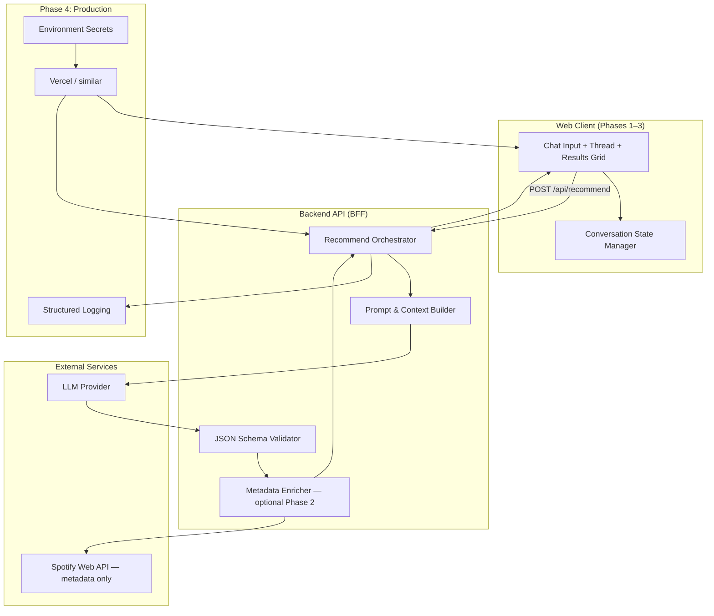

# Phase-Wise Architecture — AI Music Discovery MVP

> **Working name:** Music Buddy (conversational discovery agent)  
> **Strategic goal:** Reduce discovery friction and increase meaningful music discovery through AI-native, explainable recommendations.

---

## 1. Executive Summary

This MVP is a **single-page conversational web app** where users describe what they want in natural language and receive a short list of **genuinely new** tracks—each with a **one-sentence explanation** of why it was picked. Users can iteratively refine results ("more upbeat," "less famous") like talking to a friend.

Traditional recommendation systems optimize for *reinforcement* (comfort, familiarity, save rate). This product optimizes for **intent translation + trust**: turning messy human goals ("sad like Phoebe but nothing I've heard") into auditable picks the user understands well enough to seek out on their own.

---

## 2. MVP Scope Boundaries

### In scope

| Capability | Description |
|---|---|
| Natural-language input | Free-text chat describing mood, artists, constraints |
| LLM recommendations | ~10 tracks per turn with one-sentence reasons |
| Multi-turn refinement | "More upbeat," "less indie," etc. |
| Visual result cards | Song title, artist name, reason text |
| Album art (Phase 2) | Cover images via metadata API when resolvable |
| Production deployment | Public HTTPS URL for demo/evaluation |

### Explicitly out of scope (MVP)

| Excluded | Rationale |
|---|---|
| **"Open in Spotify" links/buttons** | MVP focuses on discovery + explainability, not playback handoff |
| **Spotify OAuth / user login** | No listening history integration in MVP |
| **In-app audio playback** | No embedded player or streaming |
| **Deep links to any music platform** | Apple Music, YouTube Music, etc. deferred |
| **Save/like to external library** | No write actions to Spotify or other services |

> **Note:** Spotify Web API may still be used **server-side only** in Phase 2 to resolve album art and canonical track/artist names. No Spotify URLs are exposed in the UI.

Detailed phase documents live in [`Docs/phases/`](./phases/).

---

## 3. Why AI (and Why Not Traditional Rec Alone)

| Limitation of traditional rec | What AI unlocks | UX change |
|---|---|---|
| Optimizes adjacent-to-known taste; surfaces are weekly rituals, not continuous dialogue | Parses nuance, negation, and refinement ("weirder," "ease me into jazz") in one turn | User *steers* discovery instead of browsing static playlists |
| Black-box rankings; users don't know *why* a track appeared | Generates per-track rationale tied to the user's stated intent | Explanations build trust → lower "evaluation tax" |
| Context-blind (focus vs. party vs. boredom) unless heavily engineered | Single prompt can encode mood, stakes, and novelty constraints together | Same surface adapts to high-stakes ("dinner party") vs. low-stakes ("background focus") jobs |
| Cold-start and "nothing famous / nothing I've heard" are hard filter expressions | LLM can reason over obscurity, genre adjacency, and artist emergence heuristics | Explicit control over novelty without menu-hopping |

**Core insight:** Discovery friction is partly *trust* friction. Explainability is the MVP's differentiator—not another ranked feed.

---

## 4. High-Level System Architecture



### Request lifecycle (happy path)

1. User submits natural-language request (or refinement).
2. Client sends `{ message, history?, priorTrackKeys? }` to backend.
3. Backend builds prompt: system rules + conversation history + dedupe list.
4. LLM returns structured JSON: recommendations + optional assistant summary.
5. Backend validates schema; retries once on malformed output.
6. *(Phase 2)* Metadata enricher resolves album art + canonical names; drops unresolvable tracks or keeps LLM text with placeholder art.
7. Client renders cards: **album art, title, artist, reason** — no external links.

---

## 5. Tech Stack

| Layer | Choice | Rationale |
|---|---|---|
| Framework | **Next.js 14+ (App Router)** | Single repo: React UI + API routes |
| Language | **TypeScript** | Shared types between client and API |
| LLM | **OpenAI GPT-4o-mini** or **Claude 3.5 Haiku** | Cost-effective; strong JSON mode |
| Metadata (Phase 2) | **Spotify Web API** (Client Credentials) | Album art + name normalization only |
| Styling | **Tailwind CSS** | Fast iteration on chat + card layout |
| Validation | **Zod** | Runtime schema for LLM output + API contracts |
| Deployment | **Vercel** | Zero-config Next.js deploy |
| Analytics (Phase 5) | **Vercel Analytics** or lightweight custom events | Session metrics without heavy infra |

---

## 6. Phase Index

| Phase | Document | Duration | Summary |
|---|---|---|---|
| **0** | [phase-0-foundation.md](./phases/phase-0-foundation.md) | 2–3 days | Repo, env, prompt contract, API key validation |
| **1** | [phase-1-core-mvp.md](./phases/phase-1-core-mvp.md) | 4–5 days | Chat UI + LLM pipeline; text-only cards |
| **2** | [phase-2-metadata-enrichment.md](./phases/phase-2-metadata-enrichment.md) | 3–4 days | Album art + canonical names; no Spotify links |
| **3** | [phase-3-conversational-refinement.md](./phases/phase-3-conversational-refinement.md) | 3–4 days | Multi-turn history, dedupe, chat thread UX |
| **4** | [phase-4-production-deployment.md](./phases/phase-4-production-deployment.md) | 2–3 days | Deploy, harden, monitor |
| **5** | [phase-5-measurement-evaluation.md](./phases/phase-5-measurement-evaluation.md) | 3–4 days | Metrics, eval harness, graduation narrative |

**Estimated total:** ~4 weeks.

---

## 7. Cross-Cutting: LLM Contract

See [phase-0-foundation.md § Prompt Contract](./phases/phase-0-foundation.md#4-prompt-contract) for full system prompt, few-shots, and Zod schema.

**Response shape (canonical):**

```typescript
interface RecommendResponse {
  recommendations: {
    artist: string;
    track: string;
    reason: string;           // max ~200 chars, one sentence
    albumArtUrl?: string;     // Phase 2 only; omitted if unresolved
    albumName?: string;       // Phase 2 optional
  }[];
  assistantSummary?: string;  // one line for chat bubble
  meta?: {
    resolved: number;
    dropped: number;
    latencyMs: number;
  };
}
```

---

## 8. Repository Structure (Target)

```
graduation-project/
├── Docs/
│   ├── problem_statment.md
│   ├── architecture.md              ← this file (overview + index)
│   ├── demo_scenarios.md            ← Phase 5 output
│   └── phases/
│       ├── phase-0-foundation.md
│       ├── phase-1-core-mvp.md
│       ├── phase-2-metadata-enrichment.md
│       ├── phase-3-conversational-refinement.md
│       ├── phase-4-production-deployment.md
│       └── phase-5-measurement-evaluation.md
├── Solution_ideation.md
├── src/
│   ├── app/
│   │   ├── layout.tsx
│   │   ├── page.tsx
│   │   ├── globals.css
│   │   └── api/
│   │       ├── recommend/route.ts
│   │       ├── health/route.ts
│   │       └── events/route.ts      ← Phase 5 analytics
│   ├── components/
│   │   ├── chat/
│   │   │   ├── ChatThread.tsx
│   │   │   ├── ChatInput.tsx
│   │   │   └── UserMessage.tsx
│   │   ├── results/
│   │   │   ├── ResultsPanel.tsx
│   │   │   ├── ResultCard.tsx
│   │   │   └── ResultCardSkeleton.tsx
│   │   └── ui/
│   │       ├── Button.tsx
│   │       └── ErrorBanner.tsx
│   ├── lib/
│   │   ├── llm/
│   │   │   ├── client.ts
│   │   │   ├── prompts.ts
│   │   │   └── parse-response.ts
│   │   ├── metadata/
│   │   │   ├── spotify-auth.ts
│   │   │   ├── track-resolver.ts
│   │   │   └── enricher.ts
│   │   ├── conversation/
│   │   │   ├── types.ts
│   │   │   └── dedupe.ts
│   │   └── analytics/
│   │       └── events.ts
│   └── types/
│       ├── recommendation.ts
│       └── api.ts
├── .env.example
├── package.json
├── tsconfig.json
├── tailwind.config.ts
└── README.md
```

---

## 9. Success Definition (MVP Complete)

1. **Deployed** — Public HTTPS URL; reproducible from README.
2. **AI-native** — Natural-language input and multi-turn refinement work reliably.
3. **Explainable** — Every track shows a personalized one-sentence reason.
4. **Presentable** — Cards show album art (when resolvable), title, artist, reason — **no platform links**.
5. **Defensible** — Documentation articulates why this beats traditional rec for discovery friction, with Phase 5 eval data.

---

## 10. Post-MVP Extensions (Phase 6+)

| Extension | Purpose |
|---|---|
| Open in Spotify / platform deep links | Playback handoff after explainability is proven |
| Spotify OAuth + listening history | Filter known tracks; measure true novelty |
| In-app preview clips | 30s previews via licensed API |
| Embeddings rerank | LLM proposes → sonic similarity rerank |
| Smart Shuffle integration story | Position as complement to Spotify surfaces |

---

*Sourced from `Docs/problem_statment.md` and `Solution_ideation.md`. Updated: MVP excludes Spotify deep links.*
