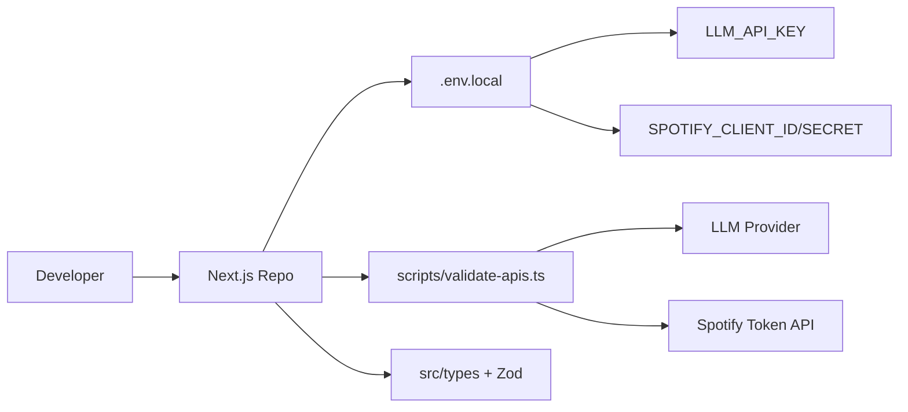

# Phase 0 — Foundation & Project Setup

**Duration:** 2–3 days  
**Goal:** Establish a runnable project skeleton, validate all external API credentials, and lock the LLM prompt contract before any UI work begins.  
**Depends on:** Nothing  
**Blocks:** Phase 1

---

## 1. Objectives

| # | Objective | Measurable outcome |
|---|---|---|
| O1 | Bootstrap Next.js + TypeScript project | `npm run dev` serves localhost without errors |
| O2 | Configure environment variables securely | `.env.example` documented; secrets never committed |
| O3 | Validate LLM API connectivity | Script returns valid JSON for sample prompt |
| O4 | Validate Spotify metadata API (optional prep for Phase 2) | Token fetch + one search succeeds |
| O5 | Lock prompt contract + Zod schemas | Shared types used by Phase 1 API route |
| O6 | CI baseline | Lint + typecheck pass on push |

---

## 2. Architecture Overview



Phase 0 produces **no user-facing features**. It produces infrastructure, contracts, and validation scripts.

---

## 3. Tasks Breakdown

### 3.1 Project initialization

```bash
npx create-next-app@latest music-buddy \
  --typescript --tailwind --eslint --app --src-dir --import-alias "@/*"
```

**Configuration choices:**

| Setting | Value | Why |
|---|---|---|
| App Router | Yes | API routes co-located with pages |
| `src/` directory | Yes | Clean separation from config |
| Tailwind | Yes | Rapid UI in Phase 1 |
| ESLint | Yes | CI gate |

**Post-init cleanup:**
- Remove default Next.js boilerplate content from `page.tsx`
- Add minimal placeholder: "Music Buddy — coming soon"
- Configure `next.config.ts` if needed (image domains for Phase 2 album art)

### 3.2 Environment configuration

**`.env.example`:**

```env
# LLM (required from Phase 1)
LLM_PROVIDER=openai          # openai | anthropic
LLM_API_KEY=
LLM_MODEL=gpt-4o-mini

# Spotify metadata only (required from Phase 2; validate in Phase 0)
SPOTIFY_CLIENT_ID=
SPOTIFY_CLIENT_SECRET=

# App
NODE_ENV=development
NEXT_PUBLIC_APP_NAME=Music Buddy
```

**`.env.local`:** Copy from example; fill real keys. Add `.env.local` to `.gitignore` (default in Next.js).

**Security rules:**
- Never log full API keys
- Never expose `LLM_API_KEY` or Spotify secrets via `NEXT_PUBLIC_*`
- All LLM and Spotify calls go through server-side API routes only

### 3.3 Spotify Developer setup (metadata only)

1. Create app at [Spotify Developer Dashboard](https://developer.spotify.com/dashboard)
2. Note **Client ID** and **Client Secret**
3. No redirect URI needed (Client Credentials flow — no user OAuth)
4. Understand: this MVP uses Spotify **only** for search + album art, **not** for links or playback

**Validation script:** `scripts/validate-spotify.ts`

```
POST https://accounts.spotify.com/api/token
  grant_type=client_credentials
  Authorization: Basic base64(clientId:clientSecret)

GET https://api.spotify.com/v1/search?q=Lomelda+Sunshine&type=track&limit=1
  Authorization: Bearer {access_token}
```

Expected: 200 + track object with `album.images[0].url`

### 3.4 LLM provider setup

**Recommended for MVP:** OpenAI `gpt-4o-mini` with `response_format: { type: "json_object" }`

**Validation script:** `scripts/validate-llm.ts`
- Send minimal system prompt + user message: "Recommend 2 sad indie songs as JSON"
- Parse response against Zod schema
- Print latency and token usage

**Alternative:** Anthropic Claude with tool use or JSON prefill in system prompt.

### 3.5 Dependency installation

```json
{
  "dependencies": {
    "next": "^14",
    "react": "^18",
    "react-dom": "^18",
    "zod": "^3.23",
    "openai": "^4"          // or @anthropic-ai/sdk
  },
  "devDependencies": {
    "typescript": "^5",
    "@types/node": "^20",
    "@types/react": "^18",
    "eslint": "^8",
    "eslint-config-next": "^14",
    "prettier": "^3"
  }
}
```

Optional Phase 0: `tsx` for running validation scripts.

---

## 4. Prompt Contract

This contract is **immutable across phases** unless explicitly versioned (`PROMPT_VERSION=v1`).

### 4.1 System prompt (v1)

```
You are Music Buddy, an AI music discovery assistant. Your job is to recommend
real, existing songs based on the user's natural-language request.

Rules:
1. Return exactly 10 recommendations unless the user asks for a different number (max 15).
2. Each recommendation must be a real artist and track that exists in mainstream music catalogs.
3. Write exactly ONE sentence per reason — specific, honest, and tied to the user's words.
   Reference their stated mood, reference artists, or constraints explicitly.
4. When the user asks for novelty ("never heard," "nothing famous," "emerging"), bias toward
   lesser-known artists while staying truthful — do not invent fake songs or artists.
5. Respect negation ("no pop," "less sad") and refinement instructions from conversation history.
6. Do not repeat tracks already listed in PREVIOUS_RECOMMENDATIONS unless the user asks to keep them.
7. Output ONLY valid JSON matching the schema below. No markdown, no commentary outside JSON.

Response schema:
{
  "recommendations": [
    { "artist": "string", "track": "string", "reason": "string" }
  ],
  "assistantSummary": "string — one friendly line summarizing what you picked"
}
```

### 4.2 Few-shot examples (embed in system prompt)

**Example A — Initial discovery:**
```
User: I love Phoebe Bridgers but I'm bored of her. Sad quiet vibe, nothing famous.
Assistant JSON: {
  "recommendations": [
    {
      "artist": "Lomelda",
      "track": "Sunshine",
      "reason": "Quiet, confessional folk with the same intimate, whispered vocals you love in Phoebe, but she's far less mainstream so this is likely new to you."
    }
    // ... 9 more
  ],
  "assistantSummary": "Here are 10 whisper-soft, under-the-radar picks in Phoebe's emotional lane."
}
```

**Example B — Refinement:**
```
User: These are great but make them a bit more upbeat.
Assistant JSON: {
  "recommendations": [ /* new list, higher energy, same emotional palette */ ],
  "assistantSummary": "Same intimate feel, but with a bit more lift and forward momentum."
}
```

**Example C — High-stakes context:**
```
User: Dinner party tonight — interesting but safe, nothing weird or abrasive.
Assistant JSON: {
  "recommendations": [ /* accessible, crowd-pleasing but not overplayed */ ],
  "assistantSummary": "Polished, conversation-friendly picks that still feel fresh."
}
```

### 4.3 Zod schemas

**File:** `src/types/recommendation.ts`

```typescript
import { z } from "zod";

export const LlmRecommendationSchema = z.object({
  artist: z.string().min(1).max(200),
  track: z.string().min(1).max(200),
  reason: z.string().min(10).max(250),
});

export const LlmResponseSchema = z.object({
  recommendations: z.array(LlmRecommendationSchema).min(1).max(15),
  assistantSummary: z.string().max(300).optional(),
});

export type LlmResponse = z.infer<typeof LlmResponseSchema>;
```

**File:** `src/types/api.ts`

```typescript
export interface RecommendRequest {
  message: string;
  history?: { role: "user" | "assistant"; content: string }[];
  priorTrackKeys?: string[];  // "artist|track" lowercase, Phase 3
}

export interface EnrichedRecommendation {
  artist: string;
  track: string;
  reason: string;
  albumArtUrl?: string;
  albumName?: string;
}

export interface RecommendResponse {
  recommendations: EnrichedRecommendation[];
  assistantSummary?: string;
  meta?: {
    resolved: number;
    dropped: number;
    latencyMs: number;
  };
}
```

---

## 5. Folder scaffold (Phase 0 creates empty placeholders)

Create directories and stub files with `export {}` or TODO comments:

```
src/
├── app/api/health/route.ts     → return { status: "ok" }
├── lib/llm/client.ts           → stub
├── lib/llm/prompts.ts          → SYSTEM_PROMPT constant
├── types/recommendation.ts     → Zod schemas
└── types/api.ts                → request/response interfaces
```

**Health endpoint:** `GET /api/health` returns `{ status: "ok", timestamp: ISO }`

---

## 6. CI configuration

**`.github/workflows/ci.yml`** (or local npm scripts):

```yaml
on: [push, pull_request]
jobs:
  check:
    runs-on: ubuntu-latest
    steps:
      - uses: actions/checkout@v4
      - uses: actions/setup-node@v4
        with: { node-version: 20 }
      - run: npm ci
      - run: npm run lint
      - run: npm run typecheck   # tsc --noEmit
```

**`package.json` scripts:**
```json
{
  "lint": "next lint",
  "typecheck": "tsc --noEmit",
  "validate:llm": "tsx scripts/validate-llm.ts",
  "validate:spotify": "tsx scripts/validate-spotify.ts"
}
```

---

## 7. Architecture Decisions Record (ADR)

| ID | Decision | Alternatives considered | Rationale |
|---|---|---|---|
| ADR-001 | Next.js monolith | Vite + separate FastAPI | Faster MVP; single deploy unit |
| ADR-002 | OpenAI gpt-4o-mini | GPT-4o, Claude Sonnet | Cost vs. quality balance for graduation budget |
| ADR-003 | Zod for LLM validation | Manual JSON.parse | Retry logic needs reliable schema errors |
| ADR-004 | No Spotify links in MVP | Include deep links | Explicit product scope reduction |
| ADR-005 | Client-side conversation state first | Server Redis session | Simpler Phase 1–2; migrate in Phase 3 if needed |
| ADR-006 | 10 recommendations default | 5 or 20 | Matches solution ideation; balances latency + choice |

---

## 8. Exit Criteria Checklist

- [ ] `npm run dev` starts without errors
- [ ] `npm run lint` and `npm run typecheck` pass
- [ ] `GET /api/health` returns 200
- [ ] `npm run validate:llm` returns valid JSON matching `LlmResponseSchema`
- [ ] `npm run validate:spotify` obtains token and resolves one track with album art URL
- [ ] `.env.example` committed; `.env.local` gitignored
- [ ] System prompt v1 + Zod schemas committed in `src/lib/llm/prompts.ts` and `src/types/`
- [ ] README stub with setup instructions (clone → env → dev)

---

## 9. Risks & Mitigations (Phase 0)

| Risk | Impact | Mitigation |
|---|---|---|
| Spotify API approval delay | Blocks Phase 2 prep | Register early; Phase 1 doesn't need Spotify |
| LLM API billing not set up | Blocks all development | Add payment method before Phase 0 ends |
| Wrong model doesn't follow JSON | Broken Phase 1 | Test 3 models in validation script; pick best |
| Keys committed to git | Security incident | Use `git-secrets` or pre-commit hook scanning `.env` |

---

## 10. Handoff to Phase 1

Phase 1 inherits:
- Working Next.js app with Tailwind
- `LlmResponseSchema` + `RecommendRequest/Response` types
- `lib/llm/client.ts` stub ready for implementation
- `lib/llm/prompts.ts` with full system prompt
- Validated LLM credentials

Phase 1 does **not** require Spotify to be functional in the app—only validated for future use.
