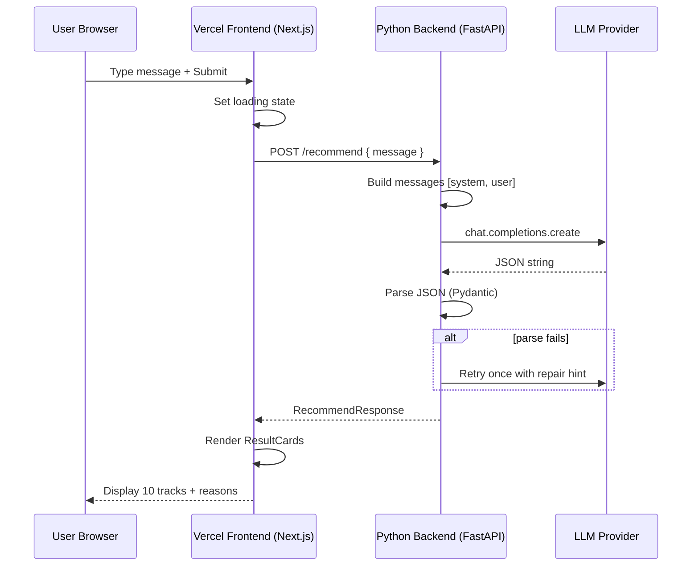

# Phase 1 — Core MVP (LLM + Minimal UI)

**Duration:** 4–5 days  
**Goal:** Ship an end-to-end "talk → explain" loop: user types a request, LLM returns 10 tracks with reasons, UI renders text-only result cards.  
**Depends on:** Phase 0  
**Blocks:** Phase 2, Phase 3

---

## 1. Objectives

| # | Objective | Measurable outcome |
|---|---|---|
| O1 | Implement LLM client with JSON parsing + retry | 95%+ successful parses on test prompts |
| O2 | Build `/api/recommend` endpoint | POST returns `RecommendResponse` in < 10s p95 |
| O3 | Build single-page chat + results UI | User can submit query and see 10 cards |
| O4 | Handle loading, empty, and error states | No uncaught exceptions in browser |
| O5 | Prove core thesis in demo | Phoebe Bridgers example works end-to-end |

**Explicitly not in Phase 1:** Album art, Spotify enrichment, multi-turn history, production deploy, external links.

---

## 2. System Architecture (Deployment Split)

**Frontend:** Next.js (Deployed on **Vercel**)  
**Backend:** Python / FastAPI (Deployed separately, e.g., Render/Railway)



### Component diagram

```
┌──────────────────────────────────────────────────────────┐
│  page.tsx (Home)                                         │
│  ┌────────────────────┐  ┌─────────────────────────────┐ │
│  │ ChatInput          │  │ ResultsPanel                │ │
│  │ - textarea         │  │ └─ ResultCard × N           │ │
│  │ - submit button    │  │    - artist + track         │ │
│  │ - disabled loading │  │    - reason (highlight)     │ │
│  └────────────────────┘  └─────────────────────────────┘ │
│  ┌────────────────────┐                                  │
│  │ ErrorBanner        │                                  │
│  └────────────────────┘                                  │
└──────────────────────────────────────────────────────────┘
```

---

## 3. Backend Design

### 3.1 File: `src/lib/llm/client.ts`

**Responsibilities:**
- Instantiate OpenAI/Anthropic client from env
- Call chat completion with system + user messages
- Return raw string content

**Interface:**

```typescript
export async function completeChat(
  messages: { role: "system" | "user" | "assistant"; content: string }[]
): Promise<string>;
```

**Configuration:**

| Parameter | Value |
|---|---|
| Model | `process.env.LLM_MODEL` (default `gpt-4o-mini`) |
| Temperature | `0.7` (some creativity for diverse picks) |
| Max tokens | `2000` |
| Response format | `{ type: "json_object" }` (OpenAI) |
| Timeout | 30 seconds |

### 3.2 File: `src/lib/llm/parse-response.ts`

**Responsibilities:**
- Parse JSON string
- Validate with `LlmResponseSchema`
- On failure: throw typed `LlmParseError` with raw snippet for logging

**Retry strategy (in route handler):**

```
Attempt 1 → parse
  ↓ fail
Attempt 2 → append user message: "Your previous response was invalid JSON. Return ONLY valid JSON matching the schema."
  ↓ fail
Return 502 { error: "Could not generate recommendations" }
```

### 3.3 File: `src/app/api/recommend/route.ts`

**Endpoint:** `POST /api/recommend`

**Request body:**

```json
{ "message": "I love Phoebe Bridgers but I'm bored..." }
```

**Validation:**
- `message` required, string, trim, length 3–2000
- Return `400` if invalid

**Handler flow:**

```typescript
export async function POST(req: Request) {
  const start = Date.now();
  const { message } = await parseRequestBody(req);

  const messages = [
    { role: "system", content: SYSTEM_PROMPT },
    { role: "user", content: message },
  ];

  const raw = await completeChat(messages);
  const parsed = await parseWithRetry(messages, raw);

  const response: RecommendResponse = {
    recommendations: parsed.recommendations,
    assistantSummary: parsed.assistantSummary,
    meta: {
      resolved: parsed.recommendations.length,
      dropped: 0,
      latencyMs: Date.now() - start,
    },
  };

  return Response.json(response);
}
```

**Error mapping:**

| Condition | HTTP | User message |
|---|---|---|
| Invalid request body | 400 | "Please enter a message." |
| LLM timeout | 504 | "Taking too long — try again." |
| Parse failure after retry | 502 | "Couldn't process recommendations." |
| Missing API key | 500 | "Service misconfigured." (log server-side) |

**Rate limiting (basic):** Optional in Phase 1 — defer to Phase 4. Log request IP for now.

---

## 4. Frontend Design

### 4.1 Layout: `src/app/page.tsx`

**Structure:** Single column, mobile-first, max-width `768px` centered.

**Sections:**
1. Header — app name + one-line tagline ("Tell me what you're in the mood for")
2. ChatInput — primary interaction
3. ResultsPanel — shown after first successful response
4. ErrorBanner — dismissible error state

**State (React `useState`):**

```typescript
interface PageState {
  isLoading: boolean;
  error: string | null;
  results: EnrichedRecommendation[] | null;
  assistantSummary: string | null;
  lastQuery: string | null;
}
```

Phase 1 keeps state local to page — no global store needed.

### 4.2 Component: `ChatInput.tsx`

**Props:**
```typescript
interface ChatInputProps {
  onSubmit: (message: string) => void;
  isLoading: boolean;
  placeholder?: string;
}
```

**Behavior:**
- Textarea auto-resizes (min 3 rows, max 8)
- Submit on button click or `Ctrl+Enter` / `Cmd+Enter`
- Disabled while `isLoading`
- Clear textarea after successful submit (optional — keep for refinement in Phase 3)

**Placeholder copy:**
> "I love Phoebe Bridgers but I'm bored of her. Find me sad, quiet stuff I've never heard..."

### 4.3 Component: `ResultsPanel.tsx`

**Props:**
```typescript
interface ResultsPanelProps {
  recommendations: EnrichedRecommendation[];
  assistantSummary?: string;
  isLoading?: boolean;
}
```

**Layout:**
- Optional summary line above grid (italic, muted)
- CSS Grid: 1 col mobile, 2 col tablet+
- Show skeleton cards when `isLoading`

### 4.4 Component: `ResultCard.tsx` (Phase 1 — text only)

**Visual design:**

```
┌─────────────────────────────────────┐
│  ● ● ●  (placeholder gradient)      │  ← Phase 1: no real art
│                                     │
│  Sunshine                           │  ← track name, font-semibold
│  Lomelda                            │  ← artist, text-muted
│                                     │
│  "Quiet, confessional folk with..." │  ← reason, primary content
└─────────────────────────────────────┘
```

**Placeholder art:** Generate deterministic gradient from `artist + track` hash — visually distinct per card without API calls.

```typescript
function placeholderGradient(artist: string, track: string): string {
  // hash → hue angle → CSS linear-gradient
}
```

**Accessibility:**
- Card is a `<article>` with `aria-label="{track} by {artist}"`
- Reason text is primary readable content

### 4.5 Component: `ResultCardSkeleton.tsx`

Pulsing placeholder matching card dimensions — shown during loading.

### 4.6 Component: `ErrorBanner.tsx`

Red/amber banner with retry suggestion. Props: `message`, `onDismiss`.

---

## 5. API Integration (Client)

**File:** `src/lib/api/recommend.ts`

```typescript
export async function fetchRecommendations(
  message: string
): Promise<RecommendResponse> {
  const res = await fetch("/api/recommend", {
    method: "POST",
    headers: { "Content-Type": "application/json" },
    body: JSON.stringify({ message }),
  });

  if (!res.ok) {
    const body = await res.json().catch(() => ({}));
    throw new Error(body.error ?? "Something went wrong");
  }

  return res.json();
}
```

**Page handler:**

```typescript
const handleSubmit = async (message: string) => {
  setIsLoading(true);
  setError(null);
  try {
    const data = await fetchRecommendations(message);
    setResults(data.recommendations);
    setAssistantSummary(data.assistantSummary ?? null);
  } catch (e) {
    setError(e instanceof Error ? e.message : "Unknown error");
  } finally {
    setIsLoading(false);
  }
};
```

---

## 6. Styling Guidelines (Phase 1)

| Element | Treatment |
|---|---|
| Background | Dark theme preferred (music app aesthetic) — e.g. `#0a0a0a` |
| Cards | Subtle border `border-white/10`, rounded-xl, padding 16px |
| Reason text | Slightly larger than metadata; `text-zinc-200` |
| Artist/track | `text-zinc-400` / `text-white` hierarchy |
| Loading | Skeleton pulse on cards; disable input |
| Focus states | Visible ring on textarea and button (a11y) |

Use Tailwind only — no component library required in Phase 1.

---

## 7. Testing Plan (Phase 1)

### 7.1 Manual test cases

| ID | Input | Expected |
|---|---|---|
| T1 | Phoebe Bridgers example from ideation | 10 results, each with reason mentioning mood/novelty |
| T2 | Empty submit | Client prevents submit OR API 400 |
| T3 | "Give me 3 songs" | Returns ~3 results (LLM obeying count) |
| T4 | Very long message (3000 chars) | Truncated or rejected gracefully |
| T5 | Nonsense input "asdfasdf" | Still returns music (or polite clarification in summary) |
| T6 | Network offline | Error banner shown |

### 7.2 API unit tests (optional but recommended)

- Mock LLM client; verify route returns 200 with valid schema
- Mock invalid JSON; verify retry then 502

### 7.3 Quality rubric for reasons (manual)

Score each reason 1–5 on:
- **Specificity** — references user's words?
- **Honesty** — plausible claim about artist?
- **Brevity** — one sentence, not paragraph?

Target: average ≥ 3.5 on 5 test queries.

---

## 8. Performance Targets

| Metric | Target (Phase 1) |
|---|---|
| LLM latency (p50) | < 4s |
| LLM latency (p95) | < 10s |
| Total API response (p95) | < 12s |
| Client bundle (First Load JS) | < 150kb excluding Next runtime |

---

## 9. Exit Criteria Checklist

- [ ] User can open app, type request, receive 10 recommendations
- [ ] Each card shows track name, artist name, and one-sentence reason
- [ ] Loading skeleton visible during request
- [ ] Errors display user-friendly message
- [ ] No Spotify API calls in this phase
- [ ] No external links of any kind on result cards
- [ ] Phoebe Bridgers demo query documented with screenshot
- [ ] `POST /api/recommend` logs latency to server console

---

## 10. Handoff to Phase 2

Phase 2 adds metadata enrichment **without changing the core UI contract**. Phase 1's `EnrichedRecommendation` type already has optional `albumArtUrl` — Phase 2 populates it.

**Files Phase 2 will extend:**
- `src/app/api/recommend/route.ts` — add enricher step after LLM parse
- `src/components/results/ResultCard.tsx` — swap placeholder for real `<Image>`
- New: `src/lib/metadata/*`

**Files Phase 2 will not touch:**
- Chat input flow
- LLM prompt (unless enrichment needs canonical name hints)
- Page layout structure

---

## 11. Deployment Setup

The application uses a decoupled frontend and backend for scalable hosting.

### 11.1 Backend Deployment (Render or Railway)
The Python backend (FastAPI) is located in the `backend/` directory.

**Option A: Deploy to Render (Recommended)**
1. Connect your GitHub repository to Render.
2. Render will automatically detect the `render.yaml` Blueprint file in the root.
3. Approve the creation of the `music-buddy-backend` Web Service.
4. In the Render Dashboard, add your `OPENAI_API_KEY` to the environment variables.

**Option B: Deploy to Railway**
1. Connect your GitHub repository to Railway.
2. In the Railway dashboard, set the **Root Directory** for the service to `/backend`.
3. Railway will automatically detect the `Procfile` and `requirements.txt` inside the `backend/` directory and build the Python service.
4. Add your `OPENAI_API_KEY` to the service variables.

### 11.2 Frontend Deployment (Vercel)
The Next.js frontend remains in the root of the repository.
1. Import the repository into Vercel.
2. Vercel will auto-detect the Next.js setup.
3. In the Environment Variables section, add:
   - `PYTHON_BACKEND_URL`: Set this to the public URL provided by Render or Railway (e.g., `https://music-buddy-backend.onrender.com`).
4. Deploy.
