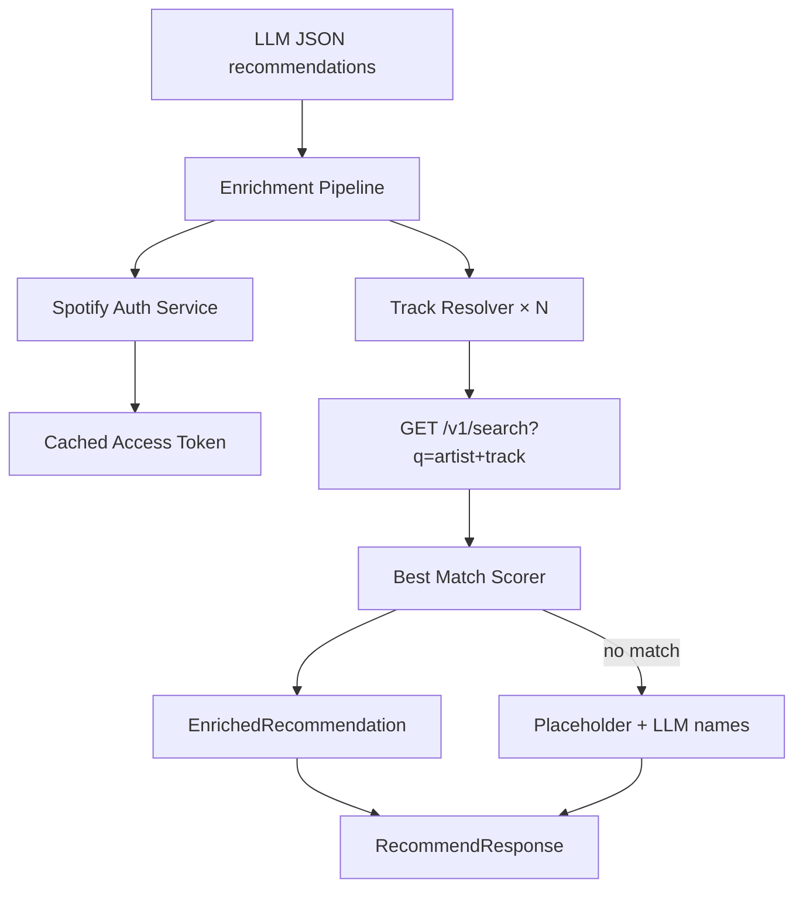

# Phase 2 — Metadata & Visual Enrichment

**Duration:** 3–4 days  
**Goal:** Enrich LLM recommendations with real album art and canonical track/artist names via Spotify Web API — **without exposing any Spotify links or playback buttons in the UI.**  
**Depends on:** Phase 1  
**Blocks:** Phase 3 (quality bar for demo)

---

## 1. Objectives

| # | Objective | Measurable outcome |
|---|---|---|
| O1 | Resolve LLM suggestions to real catalog entries | ≥ 75% enrichment success rate |
| O2 | Display album art on result cards | Images load from `i.scdn.co` CDN |
| O3 | Normalize artist/track display names | UI shows Spotify-canonical spelling |
| O4 | Graceful degradation | Unresolved tracks still show with placeholder art |
| O5 | Maintain no-link policy | Zero `open.spotify.com` URLs in API response or DOM |

**Explicitly out of scope:**
- "Open in Spotify" buttons or deep links
- Embedded Spotify player / iframe
- User OAuth or personalized Spotify data
- Returning or storing Spotify track URIs in client-visible fields (optional internal use only)

---

## 2. Architecture Overview



Enrichment runs **server-side only**, after LLM parse, before JSON response.

---

## 3. Spotify Integration Design

### 3.1 Auth: Client Credentials flow

**File:** `src/lib/metadata/spotify-auth.ts`

```typescript
interface TokenCache {
  accessToken: string;
  expiresAt: number;  // Date.now() + expires_in * 1000 - 60s buffer
}

export async function getSpotifyAccessToken(): Promise<string>;
```

**Implementation details:**
- Single in-memory cache (module-level variable)
- Refresh when `Date.now() >= expiresAt`
- On 401 from search: invalidate cache, retry once

**Token endpoint:**
```
POST https://accounts.spotify.com/api/token
Content-Type: application/x-www-form-urlencoded
Authorization: Basic base64(client_id:client_secret)
Body: grant_type=client_credentials
```

### 3.2 Track resolver

**File:** `src/lib/metadata/track-resolver.ts`

**Input:** `{ artist: string; track: string }` from LLM  
**Output:** `ResolvedTrack | null`

```typescript
interface ResolvedTrack {
  artist: string;        // canonical from Spotify
  track: string;         // canonical from Spotify
  albumArtUrl: string;   // largest available ≤ 640px
  albumName: string;
  // Internal only — NOT sent to client:
  // spotifyTrackId: string;
}
```

**Search query construction:**

```
q=track:{track} artist:{artist}
type=track
limit=5
market=US   // or omit for global
```

**Best match scoring (pick highest):**

| Signal | Weight |
|---|---|
| Exact track name match (case-insensitive) | +3 |
| Exact artist name match | +3 |
| Track name contains LLM track | +1 |
| Artist name contains LLM artist | +1 |
| Highest popularity (tie-breaker) | +0.1 × popularity |

Accept match if score ≥ 4; else return `null`.

**Retry queries on miss:**
1. `track:{track} artist:{artist}` (primary)
2. `{artist} {track}` (broad)
3. `{track}` only (last resort — verify artist overlap manually in scorer)

Max 3 search calls per recommendation.

### 3.3 Enrichment pipeline

**File:** `src/lib/metadata/enricher.ts`

```typescript
export async function enrichRecommendations(
  items: LlmRecommendation[]
): Promise<{
  enriched: EnrichedRecommendation[];
  stats: { resolved: number; dropped: number };
}>;
```

**Pipeline steps:**

1. Deduplicate input by `artist|track` key (case-insensitive)
2. Resolve tracks with **concurrency limit of 4** (avoid 429 rate limits)
3. For each item:
   - **Resolved:** use Spotify names + `albumArtUrl`
   - **Unresolved:** keep LLM `artist`, `track`, `reason`; use Phase 1 placeholder gradient
4. Optionally drop unresolved items if `< 5` resolved (config flag `DROP_UNRESOLVED=false` by default — keep all)

**Important:** Strip any internal Spotify IDs before sending response to client.

### 3.4 Response sanitization

**File:** `src/lib/metadata/sanitize.ts`

Ensure API response never includes:
- `spotifyUrl`, `external_urls`, `uri`, `href`
- Any field containing `open.spotify.com`

```typescript
export function toClientRecommendation(
  item: EnrichedRecommendation
): EnrichedRecommendation {
  return {
    artist: item.artist,
    track: item.track,
    reason: item.reason,
    albumArtUrl: item.albumArtUrl,
    albumName: item.albumName,
  };
}
```

---

## 4. API Route Changes

**Updated handler in `src/app/api/recommend/route.ts`:**

```typescript
const parsed = await parseWithRetry(messages, raw);

const { enriched, stats } = await enrichRecommendations(parsed.recommendations);

return Response.json({
  recommendations: enriched.map(toClientRecommendation),
  assistantSummary: parsed.assistantSummary,
  meta: {
    resolved: stats.resolved,
    dropped: stats.dropped,
    latencyMs: Date.now() - start,
  },
});
```

**Updated `meta.resolved`:** count of items with `albumArtUrl` present.

---

## 5. Frontend Changes

### 5.1 ResultCard with album art

**File:** `src/components/results/ResultCard.tsx`

```tsx
{item.albumArtUrl ? (
  <Image
    src={item.albumArtUrl}
    alt={`Album art for ${item.track} by ${item.artist}`}
    width={300}
    height={300}
    className="rounded-lg aspect-square object-cover"
  />
) : (
  <PlaceholderArt artist={item.artist} track={item.track} />
)}
```

**Next.js image config** — `next.config.ts`:

```typescript
const nextConfig = {
  images: {
    remotePatterns: [
      { protocol: "https", hostname: "i.scdn.co" },
      { protocol: "https", hostname: "mosaic.scdn.co" },
    ],
  },
};
```

### 5.2 Partial enrichment UX

When `meta.resolved < recommendations.length`:
- Do **not** show alarming error — most users won't notice mixed placeholder/real art
- Optional subtle footer: "Matched 8 of 10 tracks to album artwork"

### 5.3 No link elements

**Audit checklist for UI:**
- No `<a href="open.spotify.com...">`
- No `<a href="spotify:">`
- No "Listen" or "Open" buttons
- Cards are non-clickable (`<article>`, not `<a>`)

---

## 6. Caching Strategy

| Cache | Key | TTL | Storage |
|---|---|---|---|
| Spotify token | singleton | ~1 hour | In-memory |
| Search results | `artist|track` normalized | 24 hours | In-memory Map (Phase 2); Redis optional Phase 4 |

**Cache implementation (Phase 2):**

```typescript
const searchCache = new Map<string, { result: ResolvedTrack | null; cachedAt: number }>();
const CACHE_TTL_MS = 24 * 60 * 60 * 1000;
```

Benefits: refinement queries that repeat artists hit cache; reduces API quota use.

---

## 7. Error Handling & Rate Limits

### Spotify HTTP codes

| Code | Action |
|---|---|
| 200 | Process normally |
| 401 | Refresh token, retry once |
| 429 | Exponential backoff: 1s, 2s, 4s; max 3 retries |
| 5xx | Skip enrichment for that track; use placeholder |

### Degraded mode

If Spotify entirely unavailable (token failure):
- Log error server-side
- Return Phase 1-style response (LLM text + placeholder art)
- Set `meta.resolved = 0`
- App remains functional — **LLM is primary, Spotify is enhancement**

---

## 8. Performance Targets

| Metric | Target |
|---|---|
| Enrichment added latency (p50) | < 2s for 10 tracks (parallel ×4) |
| Enrichment added latency (p95) | < 4s |
| Total `/api/recommend` (p95) | < 12s (LLM + enrichment) |
| Spotify searches per request | ≤ 30 (10 tracks × 3 retries worst case) |
| Cache hit rate (refinement) | > 40% on second turn |

---

## 9. Testing Plan

### 9.1 Unit tests

| Test | Assert |
|---|---|
| `scoreMatch` exact artist+track | score ≥ 4, match selected |
| `scoreMatch` wrong artist | returns null |
| `sanitize` strips spotify URLs | no external URL fields |
| Token cache refresh | second call within TTL doesn't fetch new token |

### 9.2 Integration tests

- Mock Spotify search API with fixtures
- Full route: LLM mock → enricher → response shape

### 9.3 Manual test matrix

| LLM output quality | Expected UI |
|---|---|
| Correct artist + track | Real album art, canonical names |
| Slightly misspelled track | Fuzzy match or placeholder |
| Hallucinated fake song | Placeholder art; LLM names shown |
| Obscure indie artist | Match if in Spotify catalog; else placeholder |

### 9.4 No-link audit

Run grep on build output and DOM:
```bash
rg "open\.spotify\.com" src/ --glob !*.md
rg "spotify\.com" src/components/
```
Must return zero matches in components and API response types.

---

## 10. Exit Criteria Checklist

- [ ] ≥ 75% of test queries show real album art on majority of cards
- [ ] Canonical artist/track names displayed when resolved
- [ ] Unresolved tracks show placeholder without breaking layout
- [ ] No Spotify URLs in network response JSON (verify in DevTools)
- [ ] No clickable link elements on result cards
- [ ] `next.config.ts` image domains configured
- [ ] Degraded mode works when Spotify credentials removed
- [ ] Server logs enrichment stats: `resolved`, `dropped`, `cacheHits`

---

## 11. Handoff to Phase 3

Phase 3 adds conversation history. Enricher receives same single-turn list — dedupe of prior tracks happens **before** LLM call (prompt injection), not in enricher.

**Cache benefit:** Refinement turns that overlap prior artists benefit from search cache.

**No changes needed to sanitization** — link exclusion policy remains permanent for MVP.
