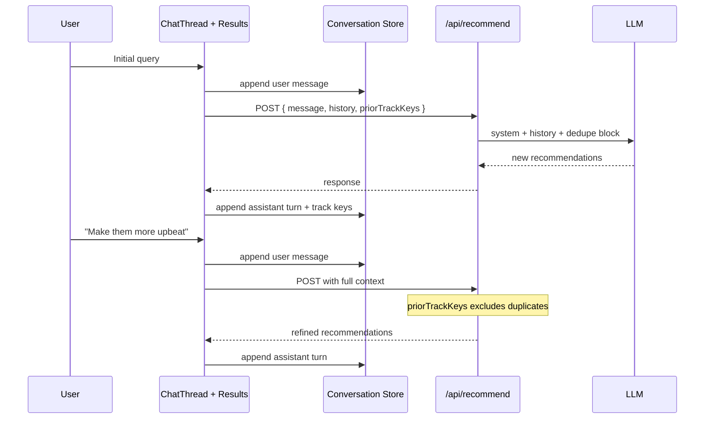

# Phase 3 — Conversational Refinement (Multi-Turn)

**Duration:** 3–4 days  
**Goal:** Transform the single-shot query UI into a true conversational experience where users refine recommendations across multiple turns without repeating tracks or losing context.  
**Depends on:** Phase 1 (required), Phase 2 (recommended for demo quality)  
**Blocks:** Phase 4, Phase 5

---

## 1. Objectives

| # | Objective | Measurable outcome |
|---|---|---|
| O1 | Persist conversation thread in UI | User sees prior messages + results |
| O2 | Send history to LLM on each turn | Refinement queries produce context-aware lists |
| O3 | Prevent duplicate track recommendations | Same artist+track not repeated across turns |
| O4 | Support "start over" | Clears thread and state cleanly |
| O5 | Maintain latency budget | p95 < 12s per turn (LLM + optional enrichment) |

**Still out of scope:** Spotify links, user accounts, server-persisted sessions (optional enhancement noted below).

---

## 2. Architecture Overview



---

## 3. Conversation Data Model

### 3.1 Types

**File:** `src/lib/conversation/types.ts`

```typescript
export interface ConversationMessage {
  id: string;                    // uuid
  role: "user" | "assistant";
  content: string;               // user text OR assistantSummary
  timestamp: number;
  recommendations?: EnrichedRecommendation[];  // assistant turns only
}

export interface ConversationState {
  messages: ConversationMessage[];
  priorTrackKeys: Set<string>;   // "artist|track" lowercase normalized
  sessionStartedAt: number;
}
```

### 3.2 Track key normalization

**File:** `src/lib/conversation/dedupe.ts`

```typescript
export function trackKey(artist: string, track: string): string {
  return `${artist.trim().toLowerCase()}|${track.trim().toLowerCase()}`;
}

export function extractTrackKeys(
  recs: EnrichedRecommendation[]
): string[] {
  return recs.map((r) => trackKey(r.artist, r.track));
}
```

### 3.3 Client-side state management

**Approach:** React `useReducer` with `conversationReducer` — avoids prop drilling, prepares for optional persistence.

**Actions:**
- `SUBMIT_USER_MESSAGE` — add user bubble, set loading
- `RECEIVE_ASSISTANT_RESPONSE` — add assistant bubble + cards, merge track keys
- `SET_ERROR` — show error on latest turn
- `RESET_CONVERSATION` — return to initial state

**Alternative:** Zustand store if reducer grows complex — not required for MVP.

---

## 4. Backend Design

### 4.1 Updated request schema

```typescript
interface RecommendRequest {
  message: string;
  history?: {
    role: "user" | "assistant";
    content: string;
  }[];
  priorTrackKeys?: string[];
}
```

**Validation rules:**

| Field | Rules |
|---|---|
| `message` | Required, 3–2000 chars |
| `history` | Max 20 messages; max 8000 total chars |
| `priorTrackKeys` | Max 150 keys (15 tracks × 10 turns) |

### 4.2 Prompt construction

**File:** `src/lib/llm/prompts.ts` — add builder:

```typescript
export function buildMessages(
  userMessage: string,
  history: { role: "user" | "assistant"; content: string }[],
  priorTrackKeys: string[]
): ChatMessage[] {
  const dedupeBlock =
    priorTrackKeys.length > 0
      ? `\n\nPREVIOUS_RECOMMENDATIONS (do NOT repeat unless user asks):\n${priorTrackKeys.join("\n")}`
      : "";

  return [
    { role: "system", content: SYSTEM_PROMPT + dedupeBlock },
    ...history.slice(-10),  // last 10 messages for token budget
    { role: "user", content: userMessage },
  ];
}
```

**Token budget management:**

| Component | Max tokens (approx) |
|---|---|
| System prompt + few-shots | ~1200 |
| History (last 10 msgs) | ~2000 |
| User message | ~500 |
| LLM output | ~2000 |
| **Total** | ~5700 (well within 128k context) |

**History trimming strategy:**
- Keep all user messages (usually short)
- For assistant messages with long summaries, truncate to 200 chars in history
- Do **not** include full recommendation lists in history — only `assistantSummary` text

### 4.3 Post-LLM dedupe (safety net)

Even with prompt instructions, LLM may repeat tracks. Server-side filter:

```typescript
function filterDuplicates(
  recs: LlmRecommendation[],
  priorTrackKeys: Set<string>
): LlmRecommendation[] {
  return recs.filter(
    (r) => !priorTrackKeys.has(trackKey(r.artist, r.track))
  );
}
```

If filter removes items and count < 8:
- Option A: Return fewer items (acceptable)
- Option B: One repair LLM call: "You repeated tracks. Replace duplicates with new ones." (prefer A for MVP simplicity)

### 4.4 Updated route handler

```typescript
export async function POST(req: Request) {
  const { message, history = [], priorTrackKeys = [] } = await parseBody(req);

  const messages = buildMessages(message, history, priorTrackKeys);
  const parsed = await parseWithRetry(messages, await completeChat(messages));

  const deduped = filterDuplicates(
    parsed.recommendations,
    new Set(priorTrackKeys)
  );

  const { enriched, stats } = await enrichRecommendations(deduped);

  return Response.json({ ... });
}
```

---

## 5. Frontend Design

### 5.1 Layout restructure

Replace single `ResultsPanel` below input with unified **chat thread**:

```
┌─────────────────────────────────────────┐
│  Header: Music Buddy                    │
├─────────────────────────────────────────┤
│  ChatThread (scrollable)                │
│  ┌─────────────────────────────────────┐│
│  │ UserMessage: "I love Phoebe..."     ││
│  ├─────────────────────────────────────┤│
│  │ AssistantMessage: "Here are 10..."  ││
│  │ ResultsGrid (10 cards)              ││
│  ├─────────────────────────────────────┤│
│  │ UserMessage: "More upbeat please"   ││
│  ├─────────────────────────────────────┤│
│  │ AssistantMessage + ResultsGrid      ││
│  └─────────────────────────────────────┘│
├─────────────────────────────────────────┤
│  ChatInput (fixed bottom)               │
│  [ Start over ]                         │
└─────────────────────────────────────────┘
```

### 5.2 Component: `ChatThread.tsx`

**Props:**
```typescript
interface ChatThreadProps {
  messages: ConversationMessage[];
  isLoading: boolean;
}
```

**Behavior:**
- Auto-scroll to bottom on new message (`scrollIntoView`)
- Each assistant message with `recommendations` renders inline `ResultsGrid`
- Loading indicator: typing dots below last user message

### 5.3 Component: `UserMessage.tsx`

Right-aligned or left-aligned bubble — pick one consistent style (left-aligned feels more "assistant chat").

### 5.4 Component: `AssistantMessage.tsx`

- Renders `content` (summary line)
- Renders `ResultsGrid` if `recommendations` present
- Subtle "Music Buddy" label

### 5.5 Component: `ResultsGrid.tsx`

Extract from Phase 1 `ResultsPanel` — reusable grid of `ResultCard` components.

### 5.6 "Start over" button

- Clears reducer state
- Resets textarea focus
- Does not call API
- Confirm dialog optional (skip for MVP — low cost action)

### 5.7 Submit flow (updated)

```typescript
const handleSubmit = async (message: string) => {
  dispatch({ type: "SUBMIT_USER_MESSAGE", payload: message });

  const history = buildHistoryForApi(state.messages);  // role + content only
  const priorTrackKeys = Array.from(state.priorTrackKeys);

  try {
    const data = await fetchRecommendations({ message, history, priorTrackKeys });
    dispatch({
      type: "RECEIVE_ASSISTANT_RESPONSE",
      payload: {
        summary: data.assistantSummary ?? "Here are your recommendations.",
        recommendations: data.recommendations,
      },
    });
  } catch (e) {
    dispatch({ type: "SET_ERROR", payload: e.message });
  }
};
```

**Client API update:**

```typescript
export async function fetchRecommendations(
  body: RecommendRequest
): Promise<RecommendResponse> { ... }
```

---

## 6. Refinement UX Patterns

### Supported user intents (via LLM, not hard-coded)

| User says | Expected behavior |
|---|---|
| "More upbeat" | Higher energy, same genre lane |
| "Less indie, more experimental" | Genre shift |
| "These are too sad" | Mood adjustment |
| "Give me 5 instead" | Count change |
| "Keep the first one but redo the rest" | Partial retain (best-effort via LLM) |
| "Something completely different" | Larger pivot; still no duplicates |

### Empty state (first visit)

Centered welcome message with 2–3 example prompts as clickable chips:

- "Sad and quiet like Phoebe Bridgers, but unknown artists"
- "Upbeat focus music, no lyrics"
- "Dinner party — interesting but safe"

Clicking chip fills textarea (does not auto-submit).

---

## 7. Optional: Server-Side Session (Stretch)

If page refresh losing history is unacceptable for demo:

```typescript
// POST /api/session → { sessionId }
// Recommend request includes sessionId
// Server stores history in memory Map (or Vercel KV)
```

**Defer unless required** — client-side state sufficient for graduation demo if evaluator doesn't refresh.

---

## 8. Rate Limiting (Lightweight)

**File:** `src/lib/rate-limit.ts`

Simple in-memory sliding window per IP:

| Limit | Value |
|---|---|
| Requests per IP per minute | 10 |
| Max message length | 2000 chars |

Return `429` with `{ error: "Too many requests. Please wait." }`

Use `x-forwarded-for` header on Vercel.

---

## 9. Testing Plan

### 9.1 Conversation flow tests

| ID | Scenario | Pass criteria |
|---|---|---|
| C1 | Initial → refine → refine (3 turns) | 3 distinct result sets; no duplicate tracks |
| C2 | "More upbeat" after sad query | Reasons mention energy/lift; different artists |
| C3 | Start over mid-conversation | Thread empty; priorTrackKeys cleared |
| C4 | 10-turn stress test | No crash; history trims gracefully |
| C5 | Submit while loading | Second submit disabled |
| C6 | Duplicate-heavy LLM response | Server filter removes dupes; ≥ 5 results remain |

### 9.2 History payload inspection

DevTools → Network → verify `priorTrackKeys` grows each turn and `history` contains prior summaries (not full track lists).

### 9.3 Accessibility

- Chat thread announced as `role="log"` with `aria-live="polite"`
- New assistant results trigger screen reader notification

---

## 10. Performance Targets

| Metric | Target |
|---|---|
| Client re-render on new message | < 100ms |
| Auto-scroll | Smooth, no layout jump |
| Memory (10 turns × 10 tracks) | < 5MB client state |
| API p95 per turn | < 12s |

---

## 11. Exit Criteria Checklist

- [ ] Chat thread shows user + assistant messages chronologically
- [ ] Each assistant turn includes summary + result cards inline
- [ ] Refinement queries produce visibly different recommendations
- [ ] No duplicate artist+track across turns (manual 3-turn test)
- [ ] "Start over" resets conversation
- [ ] Example prompt chips on empty state
- [ ] Loading state prevents double submission
- [ ] No Spotify or external links on cards (regression check)
- [ ] Rate limit returns 429 when exceeded (manual test with script)

---

## 12. Handoff to Phase 4

Phase 4 deploys Phase 3 feature-complete app. Ensure:
- All conversation state is client-side (no deploy blocker)
- Environment variables documented for production
- No debug logging of full conversation in production (PII-adjacent)

**Demo script for evaluators (draft):**
1. Enter Phoebe Bridgers query → review reasons
2. Say "more upbeat" → compare lists
3. Say "less indie, more experimental" → third list
4. Highlight explainability — no menus, no links, pure discovery dialogue
