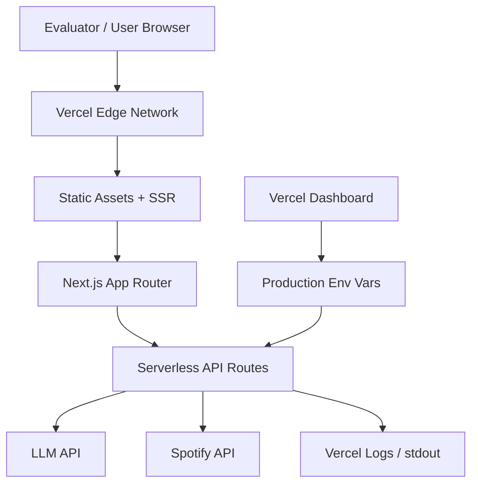

# Phase 4 — Production Deployment

**Duration:** 2–3 days  
**Goal:** Deploy the MVP to a stable public HTTPS URL with production hardening, observability, and documentation sufficient for evaluators to use without developer assistance.  
**Depends on:** Phases 1–3 (Phase 2 strongly recommended)  
**Blocks:** Phase 5 (live eval requires deployed URL)

---

## 1. Objectives

| # | Objective | Measurable outcome |
|---|---|---|
| O1 | Deploy to Vercel (or equivalent) | Public URL accessible worldwide |
| O2 | Configure production secrets | LLM + Spotify keys in host dashboard only |
| O3 | Harden API routes | Timeouts, rate limits, error sanitization |
| O4 | Add health + monitoring | `/api/health` + structured logs |
| O5 | Ship README + demo guide | Evaluator can run demo from docs alone |

---

## 2. Deployment Architecture



**Single deployment unit:** Next.js on Vercel — no separate backend service for MVP.

---

## 3. Pre-Deploy Checklist

### 3.1 Code readiness

- [ ] All Phase 1–3 exit criteria met locally with `npm run build`
- [ ] `npm run lint` and `npm run typecheck` pass
- [ ] No `console.log` of API keys, tokens, or full user messages
- [ ] No `open.spotify.com` in codebase (link exclusion regression)
- [ ] `.env.local` not committed; `.env.example` up to date

### 3.2 Build verification

```bash
npm run build
npm run start
# Test locally on http://localhost:3000 with production build
```

Common build issues:
- Missing env vars at build time (only `NEXT_PUBLIC_*` needed at build — LLM keys are runtime)
- Next.js `Image` domain config for `i.scdn.co`

---

## 4. Vercel Deployment Steps

### 4.1 Repository setup

1. Push code to GitHub/GitLab/Bitbucket
2. Connect repo to Vercel
3. Framework preset: **Next.js**
4. Root directory: project root (or `apps/web` if monorepo)

### 4.2 Environment variables (Production)

Set in Vercel → Project → Settings → Environment Variables:

| Variable | Environment | Notes |
|---|---|---|
| `LLM_PROVIDER` | Production | `openai` |
| `LLM_API_KEY` | Production | Secret — never `NEXT_PUBLIC_` |
| `LLM_MODEL` | Production | `gpt-4o-mini` |
| `SPOTIFY_CLIENT_ID` | Production | Phase 2+ |
| `SPOTIFY_CLIENT_SECRET` | Production | Secret |
| `NEXT_PUBLIC_APP_NAME` | Production | "Music Buddy" |

**Optional:**
- `RATE_LIMIT_RPM=10`
- `DROP_UNRESOLVED=false`

### 4.3 Deploy

- Trigger deploy on push to `main`
- Preview deploys on PRs (use separate LLM key with spend limit if concerned)

### 4.4 Custom domain (optional)

- Add domain in Vercel → DNS CNAME to `cname.vercel-dns.com`
- HTTPS automatic via Let's Encrypt

---

## 5. Production Hardening

### 5.1 API route security

**File:** `src/app/api/recommend/route.ts`

| Control | Implementation |
|---|---|
| Method allowlist | Reject non-POST with 405 |
| Body size limit | Next.js default 4MB sufficient; validate message ≤ 2000 chars |
| Error sanitization | Never return stack traces or API key errors to client |
| CORS | Same-origin only (default for Next API routes) |

**Safe error responses:**

```typescript
// Client sees:
{ "error": "Could not generate recommendations. Please try again." }

// Server logs:
{ "level": "error", "event": "llm_parse_failed", "latencyMs": 8234, "requestId": "..." }
```

### 5.2 Timeouts

| Operation | Timeout |
|---|---|
| LLM completion | 30s (`AbortController`) |
| Single Spotify search | 5s |
| Full `/api/recommend` | 45s (Vercel Pro: 60s serverless limit; Hobby: 10s — **verify plan**) |

**Critical:** Vercel Hobby plan has **10s serverless function timeout**. Options:
- Upgrade to Pro for 60s timeout, OR
- Optimize latency (faster model, reduce enrichment concurrency), OR
- Split: return LLM results first, enrich client-side (not recommended — exposes search)

**Recommendation:** Confirm Vercel plan before Phase 4; budget for Pro if needed.

### 5.3 Rate limiting (production)

**File:** `src/lib/rate-limit.ts`

Use in-memory limiter for single-instance; for serverless, use:
- **Vercel KV** sliding window, OR
- **Upstash Redis** (free tier), OR
- Simple IP hash in edge middleware (limited accuracy)

MVP minimum: middleware rate limit 10 req/min/IP on `/api/recommend`.

### 5.4 Input sanitization

- Trim whitespace from `message`
- Strip null bytes
- Reject messages that are only URLs (optional spam filter)

---

## 6. Observability

### 6.1 Health endpoint

**File:** `src/app/api/health/route.ts`

```typescript
export async function GET() {
  return Response.json({
    status: "ok",
    version: process.env.VERCEL_GIT_COMMIT_SHA?.slice(0, 7) ?? "local",
    timestamp: new Date().toISOString(),
  });
}
```

Use for uptime monitoring (UptimeRobot, etc.).

### 6.2 Structured logging

**File:** `src/lib/logger.ts`

```typescript
export function logEvent(event: string, data: Record<string, unknown>) {
  console.log(JSON.stringify({ event, ts: Date.now(), ...data }));
}
```

**Events to log:**

| Event | Fields |
|---|---|
| `recommend_request` | `requestId`, `historyLength`, `priorTrackCount` |
| `recommend_success` | `requestId`, `latencyMs`, `resultCount`, `resolved` |
| `recommend_error` | `requestId`, `errorType`, `latencyMs` |
| `spotify_rate_limited` | `retryAfter` |
| `enrichment_degraded` | `reason` |

**Do not log:** full user messages in production (privacy). Log message length only.

### 6.3 Error tracking (optional)

- Sentry free tier for uncaught exceptions
- Or rely on Vercel function logs for MVP

---

## 7. Performance Optimization (Pre-Deploy)

| Optimization | Impact |
|---|---|
| Use `gpt-4o-mini` not GPT-4o | −60% latency, −90% cost |
| Spotify search concurrency = 4 | Balance speed vs 429 |
| Search result cache (Phase 2) | Faster refinement turns |
| `loading.tsx` or skeleton UI | Perceived performance |
| Compress album art via Next Image | Faster LCP |

**Target production metrics:**

| Metric | Target |
|---|---|
| TTFB (page load) | < 500ms |
| `/api/recommend` p95 | < 12s (or < 10s on Hobby) |
| Lighthouse Performance | > 80 mobile |
| Lighthouse Accessibility | > 90 |

---

## 8. README Documentation

**Required sections in `README.md`:**

```markdown
# Music Buddy — AI Music Discovery MVP

## Live demo
https://your-app.vercel.app

## What it does
One-paragraph description...

## Architecture
Link to Docs/architecture.md

## Local setup
1. clone
2. cp .env.example .env.local
3. fill keys
4. npm install && npm run dev

## Environment variables
Table from .env.example

## Demo script (for evaluators)
1. ...
2. ...

## MVP scope notes
- No Spotify playback links (by design)
- Explainability-first discovery

## Tech stack
Next.js, TypeScript, OpenAI, Spotify metadata API
```

---

## 9. Security Review Checklist

- [ ] No secrets in client bundle (`npm run build && rg LLM_API_KEY .next/` → no matches)
- [ ] API keys only in server routes and `lib/llm/`, `lib/metadata/`
- [ ] Spotify credentials never sent to browser
- [ ] No open redirect vulnerabilities
- [ ] No SSRF (LLM and Spotify URLs are hardcoded endpoints)
- [ ] Rate limiting enabled on `/api/recommend`
- [ ] Dependency audit: `npm audit` — fix critical/high if feasible

---

## 10. Deployment Verification Tests

Run against **production URL** after deploy:

| ID | Test | Pass |
|---|---|---|
| D1 | Load homepage | 200, UI renders |
| D2 | `GET /api/health` | `{ status: "ok" }` |
| D3 | Submit Phoebe query | 10 results with reasons |
| D4 | Refinement turn | Different results, no dupes |
| D5 | Album art loads (Phase 2) | Images visible, no broken icons |
| D6 | Inspect network response | No `spotify.com` URLs in JSON |
| D7 | Mobile viewport (375px) | Usable layout |
| D8 | Invalid POST body | 400, no stack trace |
| D9 | Cold start after 5min idle | Still works (serverless wake) |

---

## 11. Rollback Plan

| Issue | Action |
|---|---|
| Broken deploy | Revert git commit; Vercel auto-redeploys prior |
| LLM cost spike | Rotate/disable API key; add stricter rate limit |
| Spotify quota exhausted | Set env `ENRICHMENT_ENABLED=false` flag (implement in Phase 2) |
| Vercel timeout errors | Switch to faster model; reduce track count to 7 |

---

## 12. Exit Criteria Checklist

- [ ] Production URL live and shared in README
- [ ] All D1–D9 verification tests pass
- [ ] Production env vars configured (not in git)
- [ ] Health endpoint monitored or manually verified
- [ ] Rate limiting active
- [ ] Error messages user-friendly; no stack traces exposed
- [ ] Demo script written for evaluators
- [ ] Team can redeploy from `main` push without manual steps

---

## 13. Handoff to Phase 5

Provide Phase 5 with:
- Stable production URL for user testing
- Logging events instrumented (extend for analytics)
- README demo script as base for eval scenarios
- Known limitations doc (no links, no OAuth, LLM hallucination risk)
