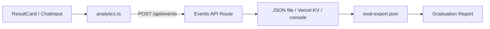

# Phase 5 — Measurement, Evaluation & Narrative

**Duration:** 3–4 days (can overlap with Phase 4 polish)  
**Goal:** Prove the product thesis with qualitative and quantitative evidence aligned to the problem statement, and produce graduation-ready documentation explaining why AI solves discovery friction better than traditional recommendation.  
**Depends on:** Phase 4 (deployed URL for live eval); Phases 1–3 for offline harness  
**Blocks:** Nothing (final phase)

---

## 1. Objectives

| # | Objective | Measurable outcome |
|---|---|---|
| O1 | Define metrics mapped to problem statement | Metrics doc with proxy definitions |
| O2 | Instrument key user events | Events fire in production |
| O3 | Run structured eval sessions | 10+ scripted scenarios scored |
| O4 | Collect explainability feedback | Reason thumbs up/down per card |
| O5 | Write graduation narrative | Why AI > traditional rec, with evidence |
| O6 | Document demo scenarios | `Docs/demo_scenarios.md` with 3+ conversations |

**Note:** Without Spotify OAuth, "meaningful discovery" (save/re-listen) is measured via **intent proxies**, not actual listening data.

---

## 2. Metrics Framework

### 2.1 Mapping problem statement → MVP metrics

| Problem statement concept | Definition | MVP proxy metric | How measured |
|---|---|---|---|
| **Discovery friction** | Cognitive/emotional cost of finding new music | Time from query submit → user engages with results | Timestamp delta; scroll to results |
| **Discovery friction** | Fear of bad recommendations | Reason trust rate | 👍/👎 on each reason |
| **Meaningful discovery** | Durable adoption of new content | Save intent | "I'd seek this out" button per card |
| **Meaningful discovery** | New artist entering rotation | N/A without OAuth | Document as limitation; use survey |
| **Repetitive listening** | High repeat ratio | N/A without listening history | Qualitative only in narrative |
| **Explainability** | User understands why track was picked | Reason clarity score | Rubric + thumbs |
| **Conversational steering** | User refines instead of abandoning | Refinement rate | % sessions with ≥ 2 turns |
| **AI suitability** | NL constraints obeyed | Constraint adherence score | Offline eval rubric |

### 2.2 Primary KPIs (MVP)

| KPI | Target | Formula |
|---|---|---|
| **Session completion rate** | > 70% | Sessions with ≥1 successful recommend / total sessions |
| **Refinement rate** | > 40% | Sessions with ≥2 turns / sessions with ≥1 turn |
| **Reason trust rate** | > 65% | 👍 / (👍 + 👎) |
| **Save intent rate** | > 25% | Cards with "I'd seek this" clicked / total cards shown |
| **Enrichment success** | > 75% | `meta.resolved / recommendations.length` |
| **Constraint adherence** | > 80% | Offline rubric pass rate on scripted queries |

### 2.3 Secondary metrics

| Metric | Purpose |
|---|---|
| p50/p95 API latency | Technical quality |
| Error rate (5xx) | Reliability |
| Avg turns per session | Engagement depth |
| Avg recommendations per session | Exposure volume |

---

## 3. Instrumentation Architecture



### 3.1 Event schema

**File:** `src/lib/analytics/events.ts`

```typescript
export type AnalyticsEvent =
  | { type: "session_start"; sessionId: string; ts: number }
  | { type: "query_submitted"; sessionId: string; turnIndex: number; messageLength: number }
  | { type: "recommendations_shown"; sessionId: string; turnIndex: number; count: number; resolved: number; latencyMs: number }
  | { type: "reason_rated"; sessionId: string; trackKey: string; rating: "up" | "down" }
  | { type: "save_intent"; sessionId: string; trackKey: string }
  | { type: "refinement_sent"; sessionId: string; turnIndex: number }
  | { type: "conversation_reset"; sessionId: string }
  | { type: "error_shown"; sessionId: string; errorType: string };
```

**Privacy rules:**
- No raw user message text in events
- `sessionId` = random UUID in `sessionStorage` (not user identity)
- No IP stored in events payload (Vercel logs separate)

### 3.2 Client helper

```typescript
export function track(event: AnalyticsEvent) {
  fetch("/api/events", {
    method: "POST",
    headers: { "Content-Type": "application/json" },
    body: JSON.stringify(event),
    keepalive: true,  // survive page unload
  }).catch(() => {});  // fire-and-forget
}
```

### 3.3 Events API route

**File:** `src/app/api/events/route.ts`

MVP storage options (pick one):

| Option | Pros | Cons |
|---|---|---|
| **Console log only** | Zero setup | Hard to aggregate |
| **Append to JSON in /tmp** | Simple | Ephemeral on serverless |
| **Vercel KV** | Persistent, queryable | Extra setup |
| **Google Sheet via webhook** | Easy sharing | External dependency |

**Recommendation for graduation:** Vercel KV or export script parsing Vercel logs.

### 3.4 UI instrumentation points

| Component | Event | Trigger |
|---|---|---|
| `page.tsx` mount | `session_start` | First load |
| `handleSubmit` | `query_submitted` | Before API call |
| `handleSubmit` success | `recommendations_shown` | After response |
| Turn ≥ 2 submit | `refinement_sent` | Before API call |
| `ResultCard` 👍/👎 | `reason_rated` | Button click |
| `ResultCard` "I'd seek this" | `save_intent` | Button click |
| Reset button | `conversation_reset` | Click |
| Error banner | `error_shown` | Error state |

### 3.5 ResultCard feedback UI (Phase 5 addition)

Add to each card (below reason):

```
[ 👍 Makes sense ]  [ 👎 Doesn't fit ]  [ ★ I'd seek this out ]
```

- Subtle, non-intrusive styling
- Disable after one selection per card per session
- No external action on "seek this out" — logs intent only

---

## 4. Offline Evaluation Harness

### 4.1 Scripted personas

**File:** `Docs/eval/personas.json`

10–15 test queries covering problem statement jobs:

| ID | Persona | Query | Constraints to verify |
|---|---|---|---|
| P1 | Boredom discovery | Phoebe Bridgers example | Novelty, sad/quiet, not famous |
| P2 | Focus flow | "Instrumental focus music, no sudden drops, 2 hours of work" | Context: low distraction |
| P3 | Dinner party | "Interesting but safe for guests, no abrasive vocals" | High stakes, low risk |
| P4 | Genre pivot | "Ease me into jazz from indie folk" | Gradual exploration |
| P5 | Refinement | P1 → "more upbeat" | Delta obedience |
| P6 | Negation | "Upbeat pop but no Taylor Swift" | Exclusion respect |
| P7 | Obscurity | "Emerging artists only, under 100k listeners" | Best-effort obscurity |
| P8 | Mood shift | "Something completely different from last list" | Diversity |
| P9 | Count change | "Just 3 songs" | Count obedience |
| P10 | Edge case | "asdfghjkl" | Graceful handling |

### 4.2 Scoring rubric

**File:** `Docs/eval/rubric.md`

Each recommendation scored 1–5 on:

| Dimension | 1 (Poor) | 5 (Excellent) |
|---|---|---|
| **Constraint adherence** | Ignores user request | Directly addresses stated constraints |
| **Reason quality** | Generic ("great song") | Specific, references user's words |
| **Novelty plausibility** | Mainstream hits when asked for obscure | Credible lesser-known picks |
| ** Diversity** | 10 samey tracks | Varied artists within genre lane |
| **Authenticity** | Likely hallucinated | Real, verifiable tracks |

**Session-level scores:**
- Refinement delta: visible shift in mood/genre?
- Duplicate rate: 0% across turns?

### 4.3 Harness script

**File:** `scripts/run-eval.ts`

```
For each persona:
  1. POST /api/recommend { message }
  2. Save response to eval/results/{persona_id}.json
  3. If refinement persona: POST with history + priorTrackKeys
  4. Output summary CSV: persona, latency, count, resolved, avg_reason_length
```

Manual scoring: team fills rubric spreadsheet from saved JSON.

---

## 5. User Testing Protocol (Live)

### 5.1 Participants

- Target: 5–8 participants ( classmates, friends who listen to Spotify)
- Duration: 10 minutes each
- Setting: deployed production URL on their device

### 5.2 Protocol script

```
1. (0:00) "Imagine you're bored of your usual playlists. Use this tool to find something new."
2. (0:30) Participant issues first query — observe silently
3. (3:00) "If it's not quite right, tell it what to change."
4. (5:00) "Tap 👍 or 👎 on a few reasons that stand out."
5. (7:00) "Would you actually look up any of these artists? Tap ★ if yes."
6. (8:00) Short interview:
   - Did the reasons help you trust the picks?
   - How is this different from Discover Weekly?
   - Would you use this again? Why/why not?
7. (10:00) Thank you
```

### 5.3 Data collected

| Source | Data |
|---|---|
| Analytics events | Quantitative KPIs |
| Interview notes | Qualitative themes |
| Screen recording (with consent) | Demo video material |

---

## 6. Graduation Narrative Structure

**Deliverable:** `Docs/graduation_report.md` (or integrate into thesis)

### 6.1 Required sections

#### A. Why traditional recommendation is insufficient

Draw from problem statement:
- Comfort trap: algorithms reinforce familiarity
- Discovery is episodic (Monday ritual), not conversational
- Black-box rankings don't reduce evaluation tax
- Low-intent contexts (focus, commute) increase friction for novelty
- **Evidence:** Compare Discover Weekly UX (no reasons) vs. Music Buddy screenshot

#### B. What AI unlocks

- Natural language as interface to taste ("nothing famous," "weirder," "ease into jazz")
- Per-track explanations tied to user intent
- Multi-turn refinement without menu navigation
- Context encoding in single prompt (mood + stakes + novelty)
- **Evidence:** Phase 5 eval scores on constraint adherence + reason trust rate

#### C. How AI changes the user experience

Before: Browse playlists → passive consumption → weekly event  
After: Describe intent → read reasons → steer conversationally → continuous discovery

Include user testing quotes (anonymized).

#### D. MVP scope and limitations (honesty section)

- No Spotify playback links (user must seek music elsewhere — friction acknowledged)
- No listening history integration (novelty claims are LLM-estimated, not verified)
- Hallucination risk for obscure artists
- Latency vs. instant playlist shuffle

#### E. Results summary

Table of KPIs vs. targets + offline rubric averages.

#### F. Future work

- Spotify OAuth for true novelty filtering
- Deep links / playback handoff
- Hybrid LLM + embedding rerank
- Integration story as Spotify feature complement

---

## 7. Demo Scenarios Document

**Deliverable:** `Docs/demo_scenarios.md`

Template per scenario:

```markdown
## Scenario 1: Bored of familiar artist

**User job:** Bored of my music, want something new that excites me

**Turn 1**
- Input: "I love Phoebe Bridgers but I'm bored..."
- Output: (paste 2-3 example cards with reasons)

**Turn 2**
- Input: "More upbeat please"
- Output: (paste 2-3 example cards)

**What to highlight in demo:**
- Reasons reference user's words
- Refinement changes energy without losing thread
- No menus, no browsing

**Screenshot:** [link or embed]
```

Minimum 3 scenarios:
1. Boredom discovery + refinement
2. Focus/work context
3. Social/high-stakes context

---

## 8. Comparative Analysis (Traditional vs. AI MVP)

| Dimension | Discover Weekly / AI DJ | Music Buddy MVP |
|---|---|---|
| Input | Implicit (history) + genre refresh | Explicit natural language |
| Output | Ranked playlist, no reasons | 10 cards with one-sentence why |
| Refinement | Wait until next week / voice steer (AI DJ) | Immediate text refinement |
| Novelty control | Opaque algorithm | User states "nothing famous" |
| Trust mechanism | Brand + track record | Explanation text |
| Playback | In-app instant | Out of scope (no links) |
| Best for | Lean-back weekly ritual | Active exploration when bored |

Use this table in presentation slides.

---

## 9. Analysis & Reporting

### 9.1 Quantitative report template

```markdown
## Evaluation Summary

**Period:** [dates]
**Sessions analyzed:** N
**Production URL:** [url]

### KPI Results
| KPI | Target | Actual |
|-----|--------|--------|
| Session completion | 70% | X% |
| Refinement rate | 40% | X% |
| Reason trust rate | 65% | X% |
| Save intent rate | 25% | X% |

### Offline Eval (15 personas)
- Avg constraint adherence: X/5
- Avg reason quality: X/5
- Enrichment success: X%

### Latency
- p50: Xms
- p95: Xms
```

### 9.2 Qualitative themes (code interview notes)

Expected themes to tag:
- "Reasons helped me trust it"
- "Felt like talking to a friend"
- "Wish I could play it directly" → acknowledge scope
- "Some artists I already knew" → novelty limitation
- "Faster than browsing playlists"

---

## 10. Deliverables Checklist

- [ ] `src/lib/analytics/events.ts` + `/api/events` route
- [ ] Feedback buttons on `ResultCard` (👍/👎/★)
- [ ] `Docs/eval/personas.json` with 10+ queries
- [ ] `Docs/eval/rubric.md`
- [ ] `scripts/run-eval.ts` executed; results saved
- [ ] 5+ user testing sessions completed
- [ ] `Docs/demo_scenarios.md` with 3+ scenarios
- [ ] `Docs/graduation_report.md` with all narrative sections
- [ ] 60-second demo video script (optional but recommended)
- [ ] KPI summary with targets vs. actuals

---

## 11. Exit Criteria (Project Complete)

The graduation project is **complete** when:

1. ✅ Deployed MVP accessible via public URL
2. ✅ Conversational discovery with explanations works across 3+ turns
3. ✅ Album art enriches results (Phase 2) without Spotify links
4. ✅ Evaluation data supports AI-native thesis with numbers and quotes
5. ✅ Documentation chain complete: problem → ideation → architecture → eval → narrative

---

## 12. Presentation Tips (60-Second Demo Script)

```
[0:00] "Spotify is great at comfort. But when you're bored of your playlists,
       discovery still feels like work."

[0:10] Type: "Sad and quiet like Phoebe Bridgers, but artists I've never heard of."

[0:25] Scroll results: "Every pick comes with a reason — why THIS song for YOU.
       That's the trust layer Spotify doesn't give you."

[0:35] Type: "More upbeat."

[0:45] "No menus. No waiting until Monday. You steer like you'd text a friend."

[0:55] "This is AI-native discovery: language in, explained picks out.
       Traditional rec tells you WHAT. We tell you WHY."
```

---

*Phase 5 closes the loop from problem statement → built MVP → measured evidence → graduation narrative.*
